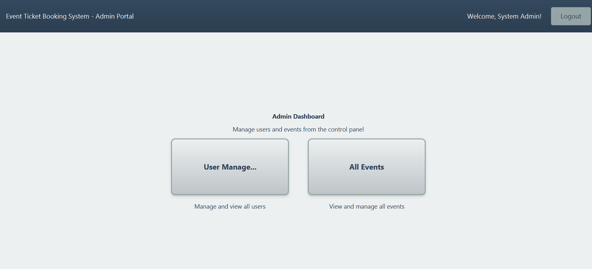

# Event Ticket Booking System

A role-based JavaFX desktop application for booking event tickets, backed by an Oracle database.


Built as a 4-person team project for a university Advanced Programming course (CS313). I worked across the database layer, the controllers, and the UI, alongside three teammates.

## Overview

The system supports three roles — Customer, Event Manager, and Admin — each with its own dashboard and permission set. Customers browse events and book tickets, managers create and track their own events, and admins manage user accounts and oversee activity across the platform. Everything runs against a three-table Oracle schema (`USERS`, `EVENTS`, `BOOKINGS`) connected by real foreign keys.

## Features

**Customer** — browse and search events, book tickets, view booking history, cancel upcoming bookings.

**Event Manager** — create, edit, and delete events, track ticket sales and remaining capacity, see who's booked into each event.

**Admin** — manage user accounts across all roles, oversee events and bookings platform-wide.

## Database

| Table | Key columns |
|---|---|
| `USERS` | USER_ID (PK), USERNAME, PASSWORD, FULL_NAME, EMAIL, PHONE, USER_TYPE |
| `EVENTS` | EVENT_ID (PK), EVENT_NAME, EVENT_TYPE, EVENT_DATE, LOCATION, TICKET_PRICE, TOTAL_SEATS, AVAILABLE_SEATS, MANAGER_ID (FK → USERS) |
| `BOOKINGS` | BOOKING_ID (PK), CUSTOMER_ID (FK → USERS), EVENT_ID (FK → EVENTS), BOOKING_DATE, NUM_TICKETS, TOTAL_AMOUNT, STATUS |

Full DDL is in [`database/schema.sql`](database/schema.sql).

## Tech stack

Java 25, JavaFX (FXML + CSS) for the UI, Oracle Database via the JDBC thin driver, and Apache Ant for the build (it's a NetBeans project). The DAO layer is built around a generic `DatabaseOperations<T>` interface, so the three DAO classes share one CRUD contract instead of each defining their own from scratch.

## Project structure

```
EventTicketBookingSystemproject/
├── src/
│   ├── controllers/     # 11 controllers — login, dashboards, CRUD pages
│   ├── database/        # DatabaseConnection + DAO classes
│   ├── helper/          # AlertHelper, ValidationHelper
│   ├── interfaces/      # DatabaseOperations<T>, Searchable
│   ├── models/          # User, Admin, Customer, EventManager, Event, Booking
│   └── views/           # FXML layouts + style.css
├── database/
│   └── schema.sql
├── lib/
│   └── ojdbc8.jar
├── docs/
│   └── project-report.docx
├── build.xml
└── README.md
```

## Running it

You'll need NetBeans, JDK 25 with JavaFX configured, and a local Oracle instance (XE works fine).

1. Clone the repo and open it in NetBeans (File → Open Project)
2. Run `database/schema.sql` against your Oracle instance
3. Update the connection details in `src/database/DatabaseConnection.java` if yours differ
4. Run the project (Shift+F6, or `ant run` from the command line)

## Screenshots

_The project report already has a full walkthrough — login, booking, cancellation, admin views — that's easy to re-crop from for these._




## Worth pointing out

`BookingDB.insert()` wraps the booking insert and the seat-count update in a single database transaction, so if either step fails, both roll back — seat counts can't drift out of sync with actual bookings. Every DAO class uses `PreparedStatement`, so there's no SQL injection surface anywhere in the data layer.

## What's not finished

The admin side has some scaffolding for usage statistics (`generateStatistics()` in the `Admin` class) that was never wired up to real queries — right now it just returns placeholder values. Testing was manual, screen by screen, not automated. DB credentials are hardcoded for local development, which I'd externalize for anything beyond a class project.
## Author

Joud Al Thonayan
Computer Science student, Princess Nourah University
[LinkedIn](https://www.linkedin.com/in/joud-al-thonayan-bb126a431) • [GitHub](https://github.com/JoudBander)
